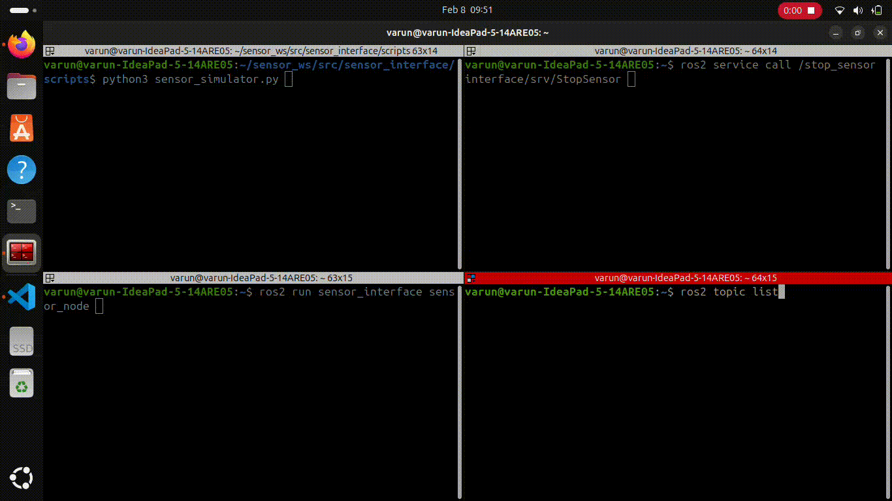

# eyeROV-Assignment

This ROS2 package provides a node to communicate with a sensor over TCP, decode its data, and publish the decoded parameters to ROS2 topics. It also includes a service to stop the sensor data stream.

---

## **Table of Contents**
1. [Overview](#overview)
2. [Prerequisites](#prerequisites)
3. [Installation](#installation)
4. [Building the Package](#building-the-package)
5. [Running the Node](#running-the-node)
6. [Using the Stop Service](#using-the-stop-service)
7. [Topics and Messages](#topics-and-messages)
8. [Service Definition](#service-definition)
9. [Testing with Sensor Simulator](#testing-with-sensor-simulator)
10. [Results](#Results)


---

## **Overview**
This package contains:
- A ROS2 node (`sensor_node.py`) that:
  - Connects to a sensor over TCP.
  - Sends a start command to the sensor with a configurable interval.
  - Receives and decodes status messages from the sensor.
  - Publishes the decoded data (voltage, temperature, yaw, pitch, roll) to ROS2 topics.
  - Provides a service to stop the sensor data stream.
- A sensor simulator (`sensor_simulator.py`) for testing the node.

---

## **Prerequisites**
- **Operating System**: Ubuntu 22.04 (recommended) or any Linux distribution supporting ROS2.
- **ROS2**: Install ROS2 Humble Hawksbill or later. Follow the [official installation guide](https://docs.ros.org/en/humble/Installation.html).
- **Python**: Python 3.8 or later.
- **Git**: Install Git for version control:
  ```
  sudo apt install git
  ```
--- 

## Installation
- Clone this repository:
  ```
  git clone https://github.com/Varun-Ajith/eyeROV-Assignment.git
  cd sensor_interface
  ```
- Build the workspace:
  ```
  colcon build
  ```
- Source the workspace:
  ```
  source install/setup.bash
  ```
---
## Building the Package

- Navigate to the workspace:
  ```
  cd sensor_interface
  ```
- Build the package:
  ```
  colcon build
  ```
- Source the workspace:
  ```
  source install/setup.bash
  ```
---

## Running the Node

- Start the sensor simulator:
```
  python3 sensor_simulator.py
```
- Run the ROS2 node:
```
  ros2 run sensor_interface sensor_node
```
- The node will:
  - Connect to the sensor.
  - Send the start command with the default interval (1000ms).
  - Publish sensor data to ROS2 topics.

---

## Using the Stop Service

To stop the sensor data stream:

- Call the stop service:
```
  ros2 service call /stop_sensor interface/srv/StopSensor
```
- The node will send the stop command (`#09`) to the sensor and stop publishing data.

---

## Topics and Messages

The node publishes the following topics:

| **Topic Name**                      | **Message Type**                      | **Description**                             |
|-------------------------------------|---------------------------------------|---------------------------------------------|
| `/sensor/supply_voltage`            |	`std_msgs/msg/UInt16`	                | Voltage supplied to the sensor (in mV).     |
| `/sensor/env_temp`	                | `std_msgs/msg/Int16`                	| Temperature of the sensor (in deci-Celsius).|
| `/sensor/yaw`	                      | `std_msgs/msg/Int16`                  | Yaw angle of the sensor (in deci-degrees).  |
| `/sensor/pitch`	                    | `std_msgs/msg/Int16`                  |	Pitch angle of the sensor (in deci-degrees).|
| `/sensor/roll`                      |	`std_msgs/msg/Int16`                  |	Roll angle of the sensor (in deci-degrees). |


---

## Service Definition

The node provides a service to stop the sensor data stream:

  - Service Name: `/stop_sensor`

  - Service Type: `interface/srv/StopSensor`

  - Request: Empty

  - Response:

    - `bool success`: Indicates whether the stop command was sent successfully.

---

## Testing with Sensor Simulator

- Run the sensor simulator:
```
  python3 sensor_simulator.py
```
- Run the ROS2 node:
```
  ros2 run sensor_interface sensor_node
```
- Observe the published data:
```
    ros2 topic echo /sensor/supply_voltage
    ros2 topic echo /sensor/env_temp
    ros2 topic echo /sensor/yaw
    ros2 topic echo /sensor/pitch
    ros2 topic echo /sensor/roll
```
- Stop the sensor data stream:
```
  ros2 service call /stop_sensor interface/srv/StopSensor
```
---

## Results



---

For questions or feedback, please contact:

  - Name: Varun Ajith

  - Email: [varunajithvarun@gmail.com](varunajithvarun@gmail.com)

  - GitHub: [Varun-Ajith](https://github.com/Varun-Ajith)
