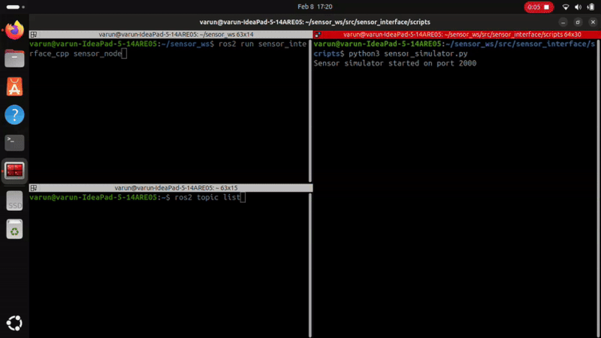

# eyeROV-Assignment

This ROS2 package provides nodes to communicate with a sensor over TCP, decode its data, and publish the decoded parameters to ROS2 topics. It includes both Python and C++ implementations, along with a sensor simulator for testing.

## Table of Contents
1. [Overview](#overview)
2. [Prerequisites](#prerequisites)
3. [Implementation Details](#implementation-details)
4. [Installation](#installation)
5. [Building the Package](#building-the-package)
6. [Running the Nodes](#running-the-nodes)
7. [Topics and Messages](#topics-and-messages)
8. [Technical Pipeline](#technical-pipeline)
9. [Testing with Sensor Simulator](#testing-with-sensor-simulator)
10. [Results](#results)

---

## Overview
This package contains:
- A Python ROS2 node (`sensor_node.py`) that handles sensor communication
- A C++ ROS2 node (`sensor_node.cpp`) providing the same functionality
- A Python-based sensor simulator (`sensor_simulator.py`) for testing both implementations
- Service definitions for controlling the sensor
- Launch files for easy deployment

Both implementations provide identical functionality:
- TCP connection management with the sensor
- Configurable start command with interval setting
- Status message decoding and publishing
- ROS2 topic publishing for sensor data
- Service interface for stopping the sensor

---

## Prerequisites
- **Operating System**: Ubuntu 22.04 (recommended)
- **ROS2**: ROS2 Humble Hawksbill or later
- **Python**: Python 3.8 or later (for Python implementation)
- **C++**: C++17 or later (for C++ implementation)
- **Build Tools**:
  ```
  sudo apt install build-essential cmake python3-colcon-common-extensions
  ```
- **ROS2 Dependencies**:
  ```
  sudo apt install ros-jazzy-rclcpp ros-jazzy-std-msgs
  ```

---

## Implementation Details

### Python Implementation
- Uses `rclpy` for ROS2 integration
- Threading for concurrent operations
- Socket programming using Python's `socket` library
- Standard Python data structures

### C++ Implementation
- Uses `rclcpp` for ROS2 integration
- POSIX sockets for TCP communication
- Standard C++ threading model
- Modern C++ features (C++17)
- Efficient binary data handling

---

## Installation
1. Clone the repository:
   ```
   git clone https://github.com/Varun-Ajith/eyeROV-Assignment.git
   cd eyeROV-Assignment
   ```

2. Create a ROS2 workspace:
   ```bash
   mkdir -p ~/ros2_ws/src
   cp -r eyeROV-Assignment ~/ros2_ws/src/
   cd ~/ros2_ws
   ```

## Building the Package

1. Install dependencies
   
2. Build the workspace:
   ```
   colcon build
   ```
   
3. Source the workspace:
   ```
   source install/setup.bash
   ```
---

## Running the Nodes

1. Start the sensor simulator:
   ```
   python3 sensor_simulator.py
   ```

2. Run either implementation:

   For Python:
   ```
   ros2 run sensor_interface sensor_node
   ```

   For C++:
   ```
   ros2 run sensor_interface sensor_node_cpp
   ```

---

## Topics and Messages

Both implementations publish to the same topics:

| **Topic Name**           | **Message Type**  | **Description**            |
|--------------------------|-------------------|----------------------------|
| `/sensor/supply_voltage` | `std_msgs/UInt16` | Sensor voltage (mV)        |
| `/sensor/env_temp`       | `std_msgs/Int16`  | Temperature (deci-°C)      |
| `/sensor/yaw`            | `std_msgs/Int16`  | Yaw angle (deci-degrees)   |
| `/sensor/pitch`          | `std_msgs/Int16`  | Pitch angle (deci-degrees) |
| `/sensor/roll`           | `std_msgs/Int16`  | Roll angle (deci-degrees)  |

---

## Technical Pipeline

### C++ Implementation Pipeline
1. **Socket Setup**
   - POSIX socket creation
   - TCP connection establishment
   - Non-blocking I/O configuration

2. **Data Processing**
   - Binary data handling using `struct` packing
   - Little-endian conversion
   - Thread-safe data processing

3. **ROS2 Integration**
   - `rclcpp` node setup
   - Publisher management
   - Parameter handling

4. **Memory Management**
   - Smart pointers for resource management
   - RAII principles
   - Exception-safe design

### Python Implementation Pipeline
1. **Socket Setup**
   - Python socket library
   - TCP connection handling
   - Threaded communication

2. **Data Processing**
   - `struct` module for binary data
   - ASCII hex decoding
   - Thread-safe operations

3. **ROS2 Integration**
   - `rclpy` node setup
   - Publisher configuration
   - Parameter management

---

## Testing with Sensor Simulator

1. Start the simulator:
   ```
   python3 sensor_simulator.py
   ```

2. Monitor topics:
   ```
   ros2 topic echo /sensor/supply_voltage
   ros2 topic echo /sensor/env_temp
   ros2 topic echo /sensor/yaw
   ros2 topic echo /sensor/pitch
   ros2 topic echo /sensor/roll
   ```

3. Stop the sensor:
   ```
   ros2 service call /stop_sensor interface/srv/StopSensor
   ```

---

## Results

Both implementations achieve similar performance metrics:
- Reliable TCP communication
- Accurate data decoding
- Real-time publishing capabilities
- Thread-safe operations
- Resource-efficient execution

For visual results, refer to the included demonstration GIF.

|  **Python**                |  **C++**                    |
|----------------------------|-----------------------------|
| |  | 

## Contact Information

- Name: Varun Ajith
- Email: [varunajithvarun@gmail.com](varunajithvarun@gmail.com)
- GitHub: [Varun-Ajith](https://github.com/Varun-Ajith)
